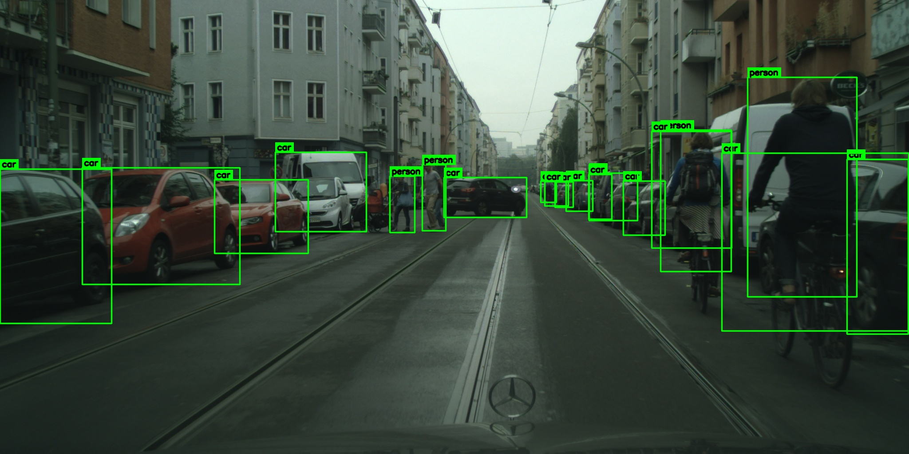
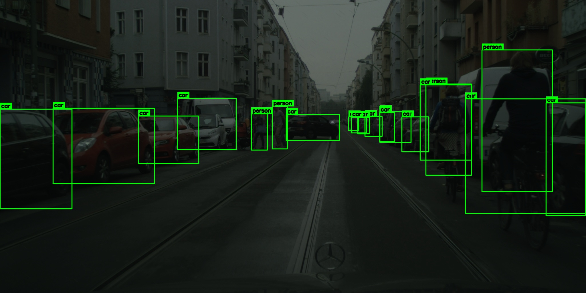
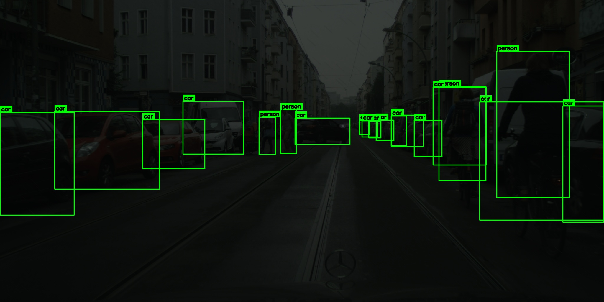
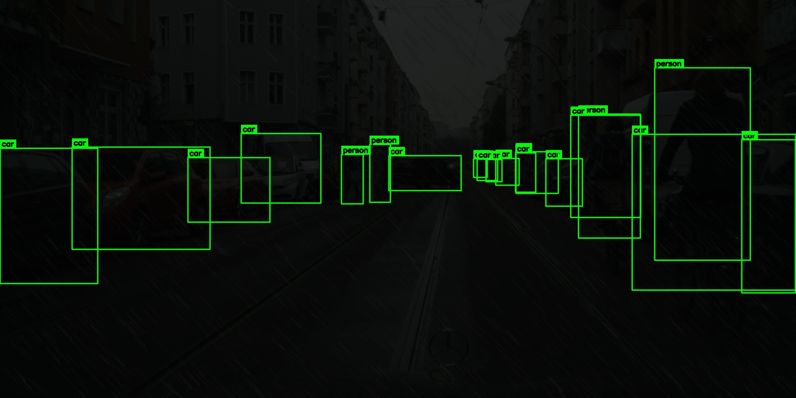

## Synthesis and Object Detection

A Python-based computer vision pipeline for generating synthetic rain and low-light driving scenes, producing YOLO-format object annotations, and evaluating object detection performance under different weather severities.

Developed as part of the **SynthVision National Hackathon**.

## 1. Problem Statement

Object detection systems used in autonomous driving, traffic monitoring, and intelligent transportation can experience performance degradation under adverse weather conditions.

Rain, reduced illumination, haze, and sensor noise can obscure objects and reduce visual contrast. Collecting and annotating real-world datasets covering these conditions is also time-consuming.

This project addresses the need for reproducible, severity-controlled adverse-weather datasets that can be used to study object detection robustness.

## 2. Proposed Solution

The pipeline transforms clear input images into synthetic rain and low-light scenes at three severity levels.

It performs the following operations:

1. Detects objects in clear images using YOLOv8.
2. Generates YOLO-format bounding-box annotations.
3. Synthesizes rain and low-light effects.
4. Produces light, medium, and heavy weather variations.
5. Preserves the original annotation geometry for synthesized images.
6. Exports metadata and supports reproducible generation.
7. Evaluates object detection performance across weather severities.

## 3. Technologies Used

| Technology | Purpose |
|---|---|
| Python | Pipeline implementation |
| YOLOv8 / Ultralytics | Object detection and annotation |
| OpenCV | Image processing and weather synthesis |
| NumPy | Numerical operations |
| PyTorch | Deep learning backend |
| python-docx | Metadata documentation |
| tqdm | Processing progress tracking |

## 4. Supported Object Classes

The pipeline supports five object classes:

- Person
- Car
- Traffic light
- Bicycle
- Bus

YOLO detections are mapped to the project's custom class IDs.

## 5. Weather Synthesis

Synthetic rain and low-light conditions are generated using severity-dependent parameters.

| Parameter | Light | Medium | Heavy |
|---|---|---|---|
| Rain intensity | 0.15–0.30 | 0.30–0.525 | 0.825–1.00 |
| Rain streak length | 10–25 px | 20–40 px | 30–60 px |
| Brightness scale | 0.75–0.90 | 0.55–0.75 | 0.35–0.55 |
| Gamma | 1.1–1.3 | 1.3–1.6 | 1.6–2.0 |

Additional visual effects include:

- Rain streaks and droplet overlays
- Depth-varying haze
- Wet-ground reflections
- Vignetting and contrast reduction
- Sensor noise and chromatic aberration

The pipeline uses deterministic per-image random seeds to support reproducible generation.

## 6. Visual Results

The following images demonstrate the weather synthesis pipeline using the same driving scene (`000344`) under different weather conditions.

| Original / Clear | Light Rain & Low Light |
|:---:|:---:|
|  |  |

| Medium Rain & Low Light | Heavy Rain & Low Light |
|:---:|:---:|
|  |  |

The visualizations illustrate how increasing weather severity affects scene visibility. The bounding boxes represent the project's object annotations.

## 7. Object Detection Evaluation

The project's existing evaluation reports the following results:

| Severity | mAP@0.5 | Precision | Recall |
|---|---:|---:|---:|
| Light | 0.041864 | 0.294179 | 0.035571 |
| Medium | 0.015303 | 0.264003 | 0.015758 |
| Heavy | 0.005578 | 0.258549 | 0.004743 |

These results indicate substantial detection-performance degradation under increasingly severe synthetic weather conditions.

The evaluation demonstrates the challenge of maintaining object detection robustness in adverse weather. It does not establish an improvement in detection accuracy.

## 8. Project Structure

```text
Adverse-Weather-Image-Synthesis-and-Object-Detection/
│
├── README.md
├── requirements.txt
├── .gitignore
│
├── pipeline_all_in_one.py
├── blender_rain_lowlight.py
├── rubric_compliance_check.py
│
└── samples/
    ├── clear/
    ├── light/
    ├── medium/
    └── heavy/
```

The `samples/` directory is intended for representative output images and will be added separately.

The full generated dataset is maintained outside this repository.

## 9. Installation

Python 3.10 or later is recommended.

Clone the repository:

```bash
git clone https://github.com/Nikhilganduri/Adverse-Weather-Image-Synthesis-and-Object-Detection.git

cd Adverse-Weather-Image-Synthesis-and-Object-Detection
```

Install the required dependencies:

```bash
pip install -r requirements.txt
```

Place clear input images inside:

```text
input_clear/images/
```

Run the complete pipeline:

```bash
python pipeline_all_in_one.py --stage all
```

Run only YOLO annotation generation:

```bash
python pipeline_all_in_one.py --stage yolo
```

Run only weather synthesis:

```bash
python pipeline_all_in_one.py --stage synth --synth-workers 4
```

Process a specific image range:

```bash
python pipeline_all_in_one.py --start-index 1 --end-index 500 --stage all
```

## 10. Reproducibility

Each synthesized image is associated with a deterministic random seed and severity-dependent parameters.

The pipeline also supports resume-safe processing by skipping outputs that have already been generated.

Metadata records include image identifiers, weather severity, synthesis parameters, resolution, annotation format, and random seeds.

## 11. Limitations

- Synthetic weather may not fully represent real-world atmospheric conditions.
- Annotations originate from detections on clear images and may contain errors.
- Preserved bounding boxes do not necessarily reflect object visibility after severe weather synthesis.
- Detection performance decreases substantially under heavy synthetic weather.
- Additional real-world validation is needed before drawing conclusions about deployment performance.

## 12. Hackathon

**Event:** SynthVision National Hackathon

**Project:** Adverse-Weather Image Synthesis and Object Detection

**Recognition:** Participation certificate

This repository documents the project's technical implementation and evaluation.

## 13. Future Scope

Potential extensions include:

- Expanding weather synthesis to fog and snow.
- Evaluating additional object detection architectures.
- Fine-tuning detection models on synthetic adverse-weather images.
- Comparing synthetic and real-world adverse-weather performance.
- Investigating domain adaptation and weather-robust detection.

## 14. Contributors

This project was collaboratively developed by a four-member team for the **SynthVision National Hackathon**. All team members contributed equally to the project's development.

| Team Member | GitHub Profile |
|---|---|
| Ganduri Venkata Nikhil | [@Nikhilganduri](https://github.com/Nikhilganduri) |
| Teammate 2 | [@OMGitsKights](https://github.com/OMGitsKights) |
| Teammate 3 | [@abhiram-pappu](https://github.com/abhiram-pappu) |
| Teammate 4 | [@username4](https://github.com/username4) |
